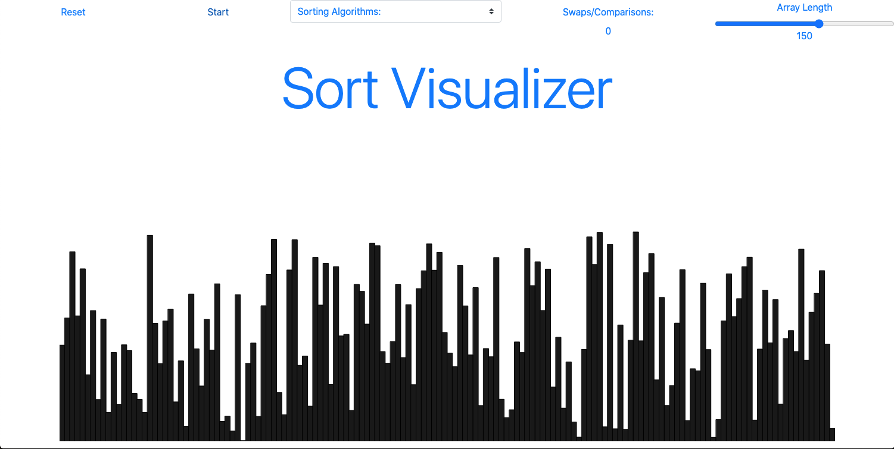
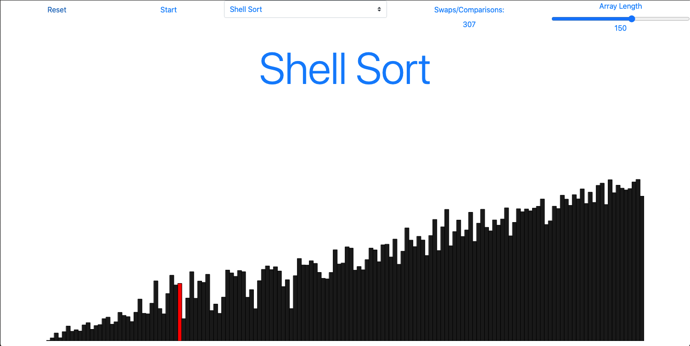
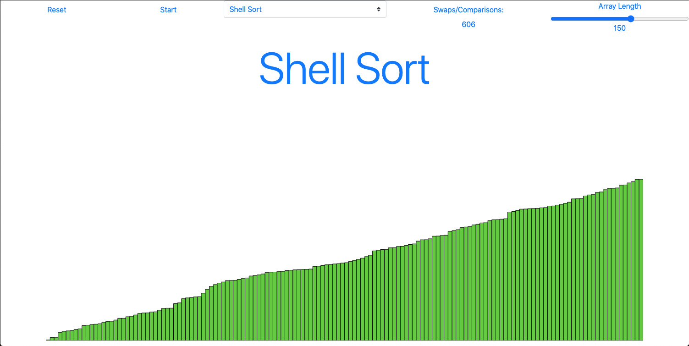

# Sort Visualizer
A sorting algorithm visualizer using p5.js library, Bootstrap HTML, and Javascript.

All you need to do is select the sort you want to visualize and click start. You can change the array length from 10 - 250. The sorting algorithm begins once you click the start button. The current index being swapped/compared will turn red and once that array/index is sorted it becomes green. Please let the sort complete before clicking reset or switching to another sort. If you wish to reset the array click the reset button. It also keeps track of the amount of swaps/comparison that the sort makes.

Enjoy, it's quite relaxing!

You can select between the following sorts:
  * Bubble Sort
  * Insertion Sort
  * Selection Sort
  * Radix Sort
  * Shell Sort
  * Cycle Sort

References:
  * https://getbootstrap.com/docs/4.5/getting-started/introduction/
  * https://p5js.org/reference/
